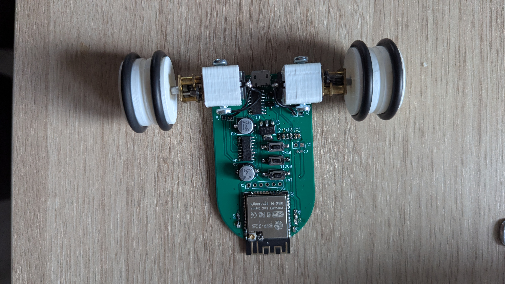

# ESP32 RC Car with Web Control

This project is a simple DIY RC car built using an **ESP32**, dual motor driver (**MX1508**), and a **web-based controller interface built with Angular**. The ESP32 acts as the brain, controlling two DC motors and hosting a lightweight web server for real-time control via Wi-Fi.

## 🚗 Features

- 🔌 Dual motor control using the MX1508 driver
- 🌐 Wi-Fi hosted Angular web app for control (no mobile app needed!)
- 🎮 Real-time forward, backward, left, right, and stop commands
- ⚙️ Easily customizable for future sensors (e.g., ultrasonic, line-following)
- 💡 Minimal wiring, compact build

## 🛠 Hardware Used

- ESP32 wroom
- MX1508 Dual Motor Driver
- 2x DC Motors (TT Gear motors or similar)
- Power Supply (Li-ion battery or USB power bank)
- Chassis, wheels, jumper wires

## 🧰 Software Stack

- ESP32 (Arduino/C++ firmware)
- Angular (Web UI for car control)
- HTML / CSS / JS (Frontend)
- WebSockets or HTTP endpoints (for command communication)
